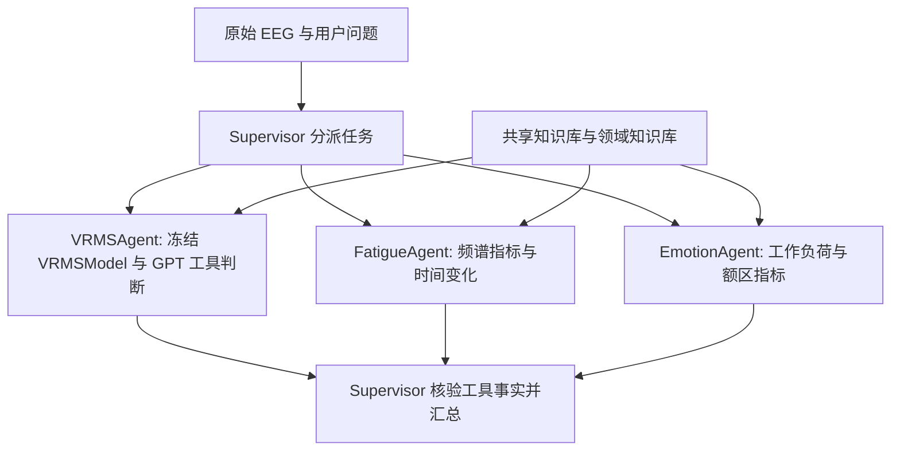

# EEGAgent

原始 EEG 网页工作台：Supervisor 调度 **VRMSAgent、FatigueAgent、EmotionAgent**，三个领域 Agent 执行本地工具、检索方法资料，再由 Supervisor 核验并汇总回答。

VRMSAgent 使用真实 GPT 函数调用给出整路径 High/Low；FatigueAgent 和 EmotionAgent 报告疲劳相关 EEG 指标、工作负荷指标及其变化。

## 当前结果：seed2026

2026-10-09 完成的原始 EEG 评价，24 名被试、同一批 146 条可评分路径，无记录开头静息参考。

| 判断来源 | 判对 / 全部路径 | ACC |
| --- | ---: | ---: |
| 真实 GPT（gpt-6.1-sol） | 108 / 146 | **73.97%** |
| VRMSModel（冻结编码器 + 整路径 MIL） | 94 / 146 | **64.38%** |

GPT 的有效输出覆盖率为 146/146。首次预测只有 105 条可评分路径得到有效 GPT 分类，随后仅补跑失败分类；有效决策没有重试或替换。GPT 纠正 28 个模型错误，同时将 14 个模型正确判断改错。

这是 GPT 实际返回的最终类别 ACC。疲劳和情绪 Agent 不参与该二分类 ACC，也没有用三个 Agent 的报告生成另一套标签。

[评价聚合与审计哈希](results/current_seed2026.json)和[匿名逐路径对照](results/current_seed2026_paths.csv)可用于复算。结果来自本次已完成的源代码快照；公开仓库做了路径、工具名称和展示层整理。迁移后的全部模型输出另做数值核对，完整 GPT 评价未在打包后再次重跑。未来 API 运行可能得到不同决策。

这批数据经过多次本地开发，且原始辅助预训练划分清单缺失，不能据此宣称独立外部泛化或完全排除预训练重叠。详细规则见[当前协议](docs/PROTOCOL.md)。

## 新增实验：优化 RAG 全路径对照

2026-10-11 的两组判断均已完成。该实验使用 `gpt-6.1-sol`、Responses、`reasoning_effort=high`，在同一批 146 条路径上固定提示与数值输入，仅改变 RAG 上下文；最终类别由 LLM 返回。

| 设置 | 判对 / 全部路径 | ACC |
| --- | ---: | ---: |
| 无 RAG（MIL + 八个工具及内部验证资料） | 104 / 146 | **71.23%** |
| 优化 RAG（按来源组的百分位案例检索） | 107 / 146 | **73.29%** |

RAG 纠正 12 条、改错 9 条，净增 **3 条 / 2.05 个百分点**；原定净增至少 4 条的目标未达到。24 条试点净增 3 条，其余 122 条净增 0 条。两组补跑使用了 CPA 与中转接口，后端权重无法独立核验，因此这是一批开发数据上的观察结果，不能把全部差异归因于 RAG。

[实现及协议](docs/OPTIMIZED_RAG.md)、[匿名逐路径结果](results/optimized_rag_paths.csv)、[最终汇总](results/optimized_rag_summary.json)与[原始输出审计索引](results/optimized_rag_source_audit.json)已发布。运行 `python -m scripts.verify_optimized_rag` 可离线复算 ACC，并重建核验全部 146 条上下文，模型 API 调用数为 0。

该对照是独立实验，网页仍采用上方 2026-10-09 的协议与结果。公开检索代码经数值回放核验；两组历史 LLM 判断没有在发布时重跑。

## 协作流程



工具只接收本轮原始波形与冻结参数；目标问卷、当前路径真实类别、历史被试答案不进入 Agent 或知识检索。检索资料作为证据处理，不能修改工具协议。

## 启动网页

使用 Python 3.10 或更高版本：

```bash
python -m pip install -e .
python -m eeg_agent serve --host 127.0.0.1 --port 8880
```

打开 <http://127.0.0.1:8880>，在“API 配置”页面填写本项目的接口、Model ID 和密钥，或复制 `.env.example` 为 `.env` 后配置。当前冻结评价使用 `gpt-6.1-sol`。调试 `mock` 会明确标记模拟来源。

`configs/local.yaml` 设置数据目录、输出目录、私有权重清单和 CUDA 工作进程。数据与权重须由持有者本地提供。未配置权重时可以运行描述性 EEG 工具与方法问答，不能发布 VRMSModel 或 GPT 路径分类。

原始数据目录结构、权重导入、WSL 配置、全路径评价与失败补跑命令见[复现说明](docs/REPRODUCTION.md)。

## 保留的内容

仓库只保留当前网页入口、所需推理模块、工具、知识卡片、评价脚本和验证。三个种子的既有 GPT/VRMSModel 结果保存在[种子结果归档](results/seed_sensitivity_archive.json)，其协议与当前原始 EEG 评价不同。正文和网页仅汇报 seed2026。

原始 EEG、问卷表、模型权重、API 响应与密钥保存在本地，不在公开仓库中。
