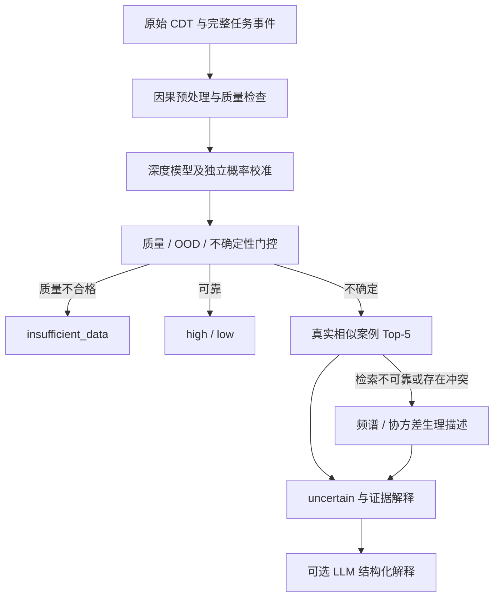

# EEGAgent Core — V2

面向 EEG 与虚拟现实不适研究的 Uncertainty-Aware EEG Agent。主要终点仍是**整条路径问卷评分 `<30` / `>=30`**；5 秒窗口继承路径弱标签。

V2 由深度模型输出校准概率 `p_cal`，Supervisor 根据内部验证得到的可靠性门槛决定工具调用和拒判。LLM 返回支持、冲突、缺失证据及解释，不能输出或修改分类概率。



## 修改后的约束

- **校准隔离**：每个外层 LOSO 折保留 14 名基础训练被试、5 名 meta 被试、4 名策略验证被试和 1 名测试被试。5 名 meta 再拆为 3 名分类头拟合、2 名独立概率校准。分类头拟合预测不参与自身校准；外层测试标签不参与校准或门槛选择。
- **内部验证门槛**：概率 margin、训练参考距离的 OOD 门槛和有效窗口比例门槛来自独立策略被试。预声明的目标为至少 8 条接受路径、35% 覆盖、80% 内部正确率；未达到目标时保留 `uncertain`。这些目标不是已验证的临床可靠性。
- **四状态**：`high / low / uncertain / insufficient_data`。缺少有效校准时 `p_cal=null`，保留单独的 `p_raw`；不把未经校准的分数冒充可靠概率。
- **真正懒调用**：`ToolReplay` 在困难样本上先请求 `CaseRetriever`，检索不可靠或冲突时才运行 Biomarker/Covariance。`vrms_cloud.prepare` 只准备 Deep、Temporal、QC 描述，不提前计算可选工具；可靠样本直接退出，云端解释也跳过。
- **Case RAG**：使用原始 Deep/Temporal 与 QC 描述的标准化距离；不按类别配额，K=5，每位历史被试最多一个案例。返回距离、实际类别计数、不同被试数和可靠范围。距离范围由内部 meta 被试 LOSO 选择，并用嵌套 LOSO 检查；未通过门槛标为 `unvalidated`。邻域 3 High / 2 Low 不是 60% 真实概率。保留最多 4 High + 4 Low 的平衡 Few-Shot 对照。
- **生理证据**：频谱变化以相对初始任务前参考的自然对数功率比描述；协方差距离为无方向变化。未经独立方向性验证，`verification.status=inconclusive`，冲突字段为 `null`，不把 Delta 增加或距离变大认定为高眩晕。
- **EOF 修复**：在分配缓存和划分被试之前重读 CEO 任务事件，缺少任务事件时使用 Trigger 通道。保留候选审计及排除原因，排除实际结束事件超出 EOF 的路径。已对本机数据只读验证：147 候选 → 146 完整路径，24 名被试。

## 安装与离线检查

Python 3.10 或以上，科学计算依赖 PyTorch、NumPy、SciPy、scikit-learn。

```bash
python -m venv .venv
# Linux / macOS: source .venv/bin/activate
# Windows: .\.venv\Scripts\Activate.ps1
python -m pip install -e ".[cloud,plot]"
python -m unittest tests.test_provider_config vrms_pilot.test_invariants vrms_pilot.test_reliability vrms_pilot.test_eligibility vrms_cloud.test_cloud vrms_cloud.test_science vrms_cloud.test_pipeline_v2 vrms_deepseek.test_contracts vrms_refine.test_contracts vrms_refine.test_retrieval vrms_weights.test_scan -v
python -m examples.assess_path --dry-run
```

测试和合成示例无需数据、API 密钥或网络。它们验证工程约束，不代表 V2 已得到性能提升。

以上命令限定 V2 发布模块。实验工作区中额外保留的 `vrms_rag` 是历史文献知识库；其冻结源码校验会拒绝与新源码混用，继续保留原缓存和结果作版本对照。

## 数据与 V2 运行

数据根目录包含 `raw/` 和 `labels/`，设置 `EEG_DATA_ROOT` 或传入 `--data-root`。所有新阶段默认使用 `outputs/<模块>/v2_seed2026`，输出已存在时要求新的运行目录。历史缓存、模型和结果保留作对照；V2 不接受旧的 147 路径缓存或原模型。

```bash
# 只读资格审计，不生成 EEG 缓存或训练
python -m vrms_pilot.experiment --stage audit --data-root /path/to/data
# 以下为正式新实验准备/训练，不是本次代码修改已完成的实验
python -m vrms_pilot.experiment --stage prepare --data-root /path/to/data
python -m vrms_pilot.experiment --stage run
python -m vrms_pilot.validate_results --data-root /path/to/data
python -m vrms_cloud.prepare
python -m vrms_cloud.independent --dry-run
python -m vrms_cloud.evaluate --offline
python -m vrms_cloud.validate --offline
# 检索对照及内部 LOSO 审计，无 API
python -m vrms_refine.prepare
python -m vrms_refine.validate
python -m vrms_refine.evaluate
```

自定义 pilot 目录时，cloud.prepare 传入 `--pilot-out`，之后各阶段传入相同 `--out`。完整复现顺序见 [REPRODUCTION](docs/REPRODUCTION.md)，统计口径和限制见 [PROTOCOL](docs/PROTOCOL.md)。

## API 配置

复制 `.env.example` 到 `.env` 并填写所选模型，环境变量优先；`EEG_CONFIG_FILE` 可指定配置文件。代码只读取本项目显式配置，不读取 Codex 登录信息。

| 分支 | 配置 |
|---|---|
| Responses / GPT | `EEG_GPT_BASE_URL`、`EEG_GPT_MODEL`、`EEG_GPT_KEY` |
| DeepSeek Chat Completions | `EEG_API_BASE_URL`、`EEG_API_MODEL`、`EEG_API_KEY` |

以下命令会实际调用接口并可能产生费用：

```bash
python -m vrms_cloud.independent --workers 4
python -m vrms_deepseek.experiment --workers 4
python -m vrms_refine.run --vendor gpt --workers 4
python -m vrms_refine.run --vendor deepseek --workers 4
```

每个运行时请求只含一个匿名查询和实际检索到的内部案例。LLM 严格返回 `supporting_evidence`、`conflicting_evidence`、`missing_evidence`、`explanation`。旧分数响应和不匹配的缓存哈希会被拒绝；API 失败保留原机器门控和 `p_cal`。

## 历史与本次验收边界

V1 源码可在提交 `205abc7` 中查看；`source_snapshot.json`、`release_manifest.json` 属于该版本的发布记录。V1 历史结果包含截断候选且数据被反复查看，不构成 V2 或稳定 LLM 增益的证据。`vrms_weights` 和旧 `improve.py` 是历史诊断，不属于 V2 的概率决策流程。

本次修改未启动正式训练或真实 API 请求。146 路径资格审计是实际数据证据；合成测试、契约测试不能替代新模型训练、真实检索 LOSO 结果、临床验证或树莓派测量。生理方向性尚未验证，V2 可以继续拒判。
