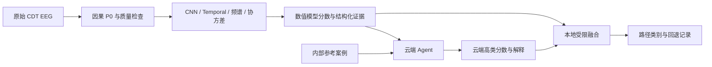

# EEGAgent Core

面向 EEG 与虚拟现实不适研究的核心实验代码：因果预处理、路径级分类、规则式自适应证据获取、云端 Agent 判断与受限融合，以及内部校准和权重诊断。

这是研究原型的源码发布。数据、训练权重、真实 API 记录与缓存不随代码公开；示例全部为合成数据。当前方法评价的是整条路径问卷评分 `<30` / `>=30`，5 秒窗口使用路径弱标签。

## 核心流程



Agent 收到模型分数、时间趋势、频谱/协方差摘要、质量信息及内部参考案例，返回 `high_probability`、`state`、`uncertain`、`reason`。原默认融合为 `0.75 * numeric + 0.25 * cloud`；API 失败保留数值结果。云端自报不确定性与 `max(p, 1-p)` 均未被证明是校准置信度。工具追加/早退出由本地规则执行。

## 目录

| 模块 | 核心内容 |
|---|---|
| [vrms_pilot](vrms_pilot/README.md) | CDT 因果处理、CNN、时间/频谱/协方差工具、LOSO、规则策略 |
| [vrms_cloud](vrms_cloud/README.md) | 路径 MIL CNN、数值候选内部选择、Responses API Agent、融合与评价 |
| [vrms_deepseek](vrms_deepseek/README.md) | 独立 DeepSeek 客户端、同输入比较、失败回退与请求审计 |
| [vrms_refine](vrms_refine/README.md) | 相似案例、可靠性上下文、内部融合/校准和选择性发布 |
| [vrms_weights](vrms_weights/README.md) | 缓存概率扫描、精确阈值区间和单独的内部选择诊断 |
| [examples](examples/evidence.json) | 无真实数据的输入与调用示例 |
| [docs](docs/PROTOCOL.md) | 数据协议、复现顺序和已知限制 |

“改进数值模型”是每折从原数值融合、路径 MIL、脑区频谱、通道频谱、切空间协方差及平均融合中，用内部政策验证 BACC 选择的流程，代码名 `validated_numeric`。

## 安装及离线检查

Python 3.10 或以上；科学计算依赖 PyTorch、NumPy、SciPy、scikit-learn。CPU 可执行测试；完整训练建议按平台安装合适的 PyTorch/CUDA。

```bash
python -m venv .venv
# Linux / macOS
source .venv/bin/activate
# Windows PowerShell 使用：.\.venv\Scripts\Activate.ps1
python -m pip install -e ".[cloud,plot]"
python -m unittest vrms_pilot.test_invariants vrms_cloud.test_cloud vrms_cloud.test_science vrms_deepseek.test_contracts vrms_refine.test_contracts vrms_weights.test_scan tests.test_provider_config -v
python examples/assess_path.py --dry-run
```

测试和 dry-run 不需要数据、API 密钥或网络请求。`examples/evidence.json` 是合成输入，不代表模型效果。

## API 配置

将 `.env.example` 复制为 `.env`，自行填写所选模型的配置；环境变量优先于 `.env`。`EEG_CONFIG_FILE` 可指定另一份显式配置文件。

| 调用分支 | 配置 |
|---|---|
| Responses API / GPT | `EEG_GPT_BASE_URL`、`EEG_GPT_MODEL`、`EEG_GPT_KEY` |
| DeepSeek Chat Completions | `EEG_API_BASE_URL`、`EEG_API_MODEL`、`EEG_API_KEY` |

Responses 的 Base URL 应为 `/responses` 之前的 API 根地址；需支持当前代码的 JSON schema 和 reasoning 参数。DeepSeek 使用 JSON-object、temperature 0、700输出token、60秒超时；原生 `deepseek-flash`/`deepseek-pro` 关闭 thinking。模型/接口可用性需由调用方确认。

下面命令会实际调用接口并可能产生费用；默认示例命令及测试不调用接口：

```bash
python examples/assess_path.py --vendor deepseek
python examples/assess_path.py --vendor gpt
```

发布版只读取本项目显式配置，不读取 Codex 登录文件，也不依赖其他本地项目。密钥不会写入请求日志或公共配置。

## 真实数据与复现

提供本地合法数据并设置 `EEG_DATA_ROOT`，或者在准备阶段传入 `--data-root`。数据根目录需要 `raw/` 和 `labels/`，详见 [协议与已知问题](docs/PROTOCOL.md) 及 [复现顺序](docs/REPRODUCTION.md)。完整实验依赖自行生成的缓存、冻结划分、模型和 API 记录，不能仅凭仓库中的合成示例重现历史准确率。

**已知问题：历史代码从 CSV 的 `is_complete` 判断路径完整性，未重新核对实际结束事件。审计发现147条候选中有一条EOF截断路径；严格原始事件完整路径为146条。** 发布副本保留历史算法并公开这一问题，未重新训练或生成修正结果。数据准备目前仍要求历史147条/24人；修正研究协议、缓存和受影响的内层选择后才能报告新的完整路径结果。

历史单种子结果：内部选择数值 ACC 63.95%，原 GPT 25%融合65.99%，原 DeepSeek 25%融合63.27%。后续改进与校准均未通过预登记采用门槛。这些是已反复查看数据上的探索结果，不构成稳定 LLM 增益、即时症状标签、临床验证或树莓派实测证据。

## 发布说明

数值网络、损失、特征、划分、策略、提示词、融合规则及现有合同测试来自本地核心代码。发布副本只作配置/路径移植、独立客户端封装、内层分析计划模板补齐与文档整理；历史手稿同步脚本未包含。原本地实验和结果保持原样。`source_snapshot.json` 保存原核心文件哈希，`release_manifest.json` 标明复制后有改动的文件及发布验证信息。不同源码哈希的历史产物不能直接通过发布版的冻结源文件验证。
