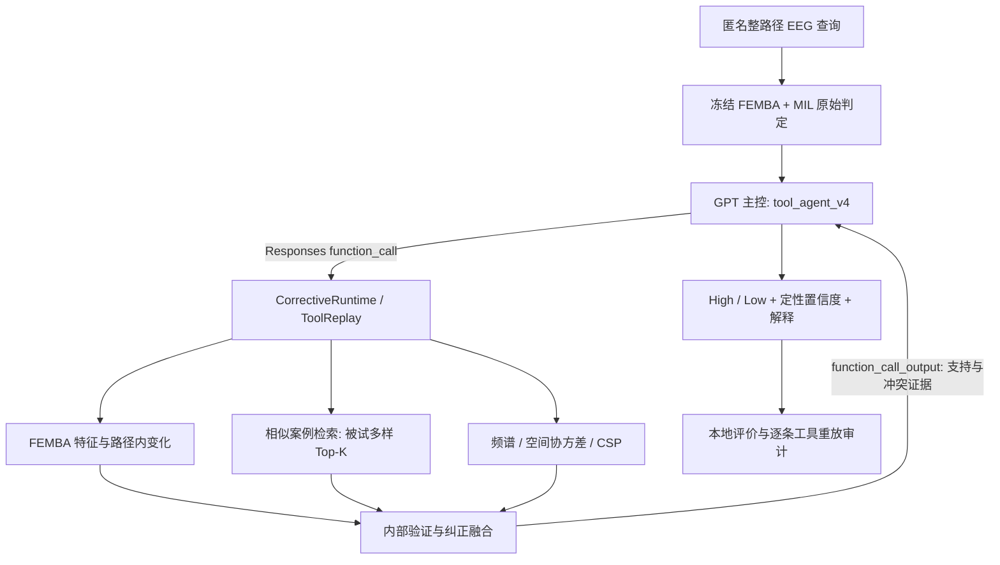

# GPT 与专家模块协作：实测 ACC 71.92%

v0.3.0 发布实际运行过的 GPT 工具协作代码、Reliability V3、冻结编码器 MIL 对照、三种子复测和离线审计。原四状态 Supervisor 与强制 High/Low 实验分别保留。

## 协作关系与实际实现

本版本采用一个 GPT 决策主控及多个确定性数值专家模块。专家负责 EEG 计算、案例检索和验证；只有主控进行 LLM 推理。多个独立 LLM 讨论、互相审核或投票不在 71.92% 实测协议中。



| 协作职责 | 代码 | 输入与输出 |
|---|---|---|
| GPT 主控 | `vrms_cloud/tool_agent_v4.py`、`tool_agent_v1.call_agent` | 请求工具，结合真实返回证据，给出最终类别；不生成新概率 |
| 深度模型 | `vrms_pilot/model_ablation_v3.py` | 冻结编码器及整路径 MIL；输出未经校准的原模型概率 |
| 特征与时间专家 | `vrms_cloud/agent_tools_v1.py`、`agent_tools_v2.py` | `femba_features`、`femba_mean`、`femba_temporal` |
| 案例检索专家 | `tool_agent_v1.EEGToolRuntime` | `case_retrieval`；按距离排序、每历史被试最多一个案例，无类别配额 |
| 生理/空间专家 | `agent_tools_v1.py`、`agent_tools_v2.py` | `spectral`、`spatial_covariance`、`spectral_compact`、`filterbank_csp`；变化描述及学习到的分类证据 |
| 纠正与验证模块 | `agent_selector_v3.py`、`agent_selector_audit_v3.py`、`tool_agent_v3.CorrectiveRuntime` | 结合 8 路证据，返回原始组合类别、margin 建议及独立嵌套审核 |
| 本地审计 | `audit_tool_agent_v4.py`、`evaluate_seed_retest.py` | 核对源代码/权重/角色哈希，重新解析实际 API 回复，逐条重放工具 |

Responses 的 `function_call` 触发实际工具运行，再通过 `function_call_output` 返回。工具复用 `ToolReplay` 缓存和计时。71.92% 运行中的全部查询都执行了 8 路证据及纠正融合；它证明了工具调用链路，不能据此宣称按样本节省了计算量。生理变化本身没有固定 high/low 方向，邻域类别比例也不是查询的真实概率。

## 实验结果

同 146 条原始事件完整路径、24 名被试、24 折 LOSO，整路径终点为问卷 `<30` / `>=30`。各折保留 base14/meta5/policy4/outer1。MIL 只用 base14、固定 12 epochs；辅助工具使用被试 OOF 选参和校准，最终用 19 名内部被试拟合，外层被试不参与。融合保留独立 policy 预测与额外嵌套审核。

| Seed | MIL 正确 / ACC | 数值融合正确 / ACC | GPT 正确 / ACC | 相对同 seed MIL 纠正 / 误改 | 双标准 |
|---|---:|---:|---:|---:|:---:|
| 2026 | 89 / 60.96% | 107 / 73.29% | 105 / 71.92% | 32 / 16 | 达到 |
| 2027 | 84 / 57.53% | 101 / 69.18% | 101 / 69.18% | 35 / 18 | 未达到 |
| 2028 | 88 / 60.27% | 106 / 72.60% | 105 / 71.92% | 28 / 11 | 达到 |

每轮 146 条真实 GPT 最终回复，全部 High/Low；回退与 uncertain 均为 0。失败尝试和恢复保留，合法但错误的回复未为挑选结果重跑。种子 2028 相对数值融合多误改 1 条；2027 两者分类完全一致；2026 数值融合多正确 2 条。辅助工具比 MIL 多使用内部训练被试，不能把总增益单独归因于 GPT。

双标准为 ACC≥70%，纠正数≥2×误改数；2/3 轮达到。GPT 三次 ACC 的均值为 71.00%，样本标准差 1.58 个百分点。这是训练随机性加新 GPT 响应的描述统计，接口没有指定 GPT seed；不是折间标准差或独立泛化置信区间。

实测源摘要和审计哈希在 [gpt_agent_metrics.json](results/gpt_agent_metrics.json)。历史迭代见 [TOOL_AGENT_ITERATIONS](TOOL_AGENT_ITERATIONS.md)，数值门控见 [RELIABILITY_V3](RELIABILITY_V3.md)。同一数据多轮开发，预训练被试重叠未排除，仍需独立外部数据验证。

## 运行入口

安装依赖后先检查工程契约；这不调用真实 API，也不启动 EEG 训练：

```bash
python -m pip install -e ".[cloud,plot]"
python -m unittest discover -v
python -m examples.assess_path --dry-run
```

源码发布不包含原始 EEG、FEMBA 权重、特征缓存、内部标签、逐条 API 对话或密钥。要重新训练，需要合法取得同协议数据、声明的编码器源码/权重，以及匹配的已完成 V2 pilot 产物；仅下载源码不能直接复现这项精确 ACC。FEMBA 预处理及参数哈希须匹配，本版本不自动下载或代替预训练权重。

工具实验阶段顺序：

```bash
# 完成匹配的 MIL 特征与模型后，准备/训练第一组工具
python -m vrms_cloud.agent_tools_v1 --prepare
python -m vrms_cloud.agent_tools_v1
python -m vrms_cloud.agent_policy_v1
# CSP 训练必须通过可导入的模块，保证 checkpoint 可以跨进程加载
python -c "from pathlib import Path; from vrms_cloud.agent_tools_v2 import prepare, train; out=Path('outputs/vrms_agent_loso/v5_tools_portable_20261008'); prepare(out); train(out)"
python -m vrms_cloud.agent_selector_v3
python -m vrms_cloud.agent_selector_audit_v3
```

实际原第四轮运行入口是 `python -m vrms_cloud.tool_agent_v4`。先在项目 `.env` / 环境变量配置 `EEG_GPT_BASE_URL`、`EEG_GPT_MODEL`、`EEG_GPT_KEY`；该步骤调用真实 API 并可能产生费用。源码不读取应用登录信息。旧缓存只有协议哈希一致时才复用。

新运行使用独立目录，显式传入已验证工具目录；以下调用与原第四轮相同主控提示词、工具及输出 schema：

```python
from pathlib import Path
from vrms_cloud.tool_agent_v3 import run
from vrms_cloud.tool_agent_v4 import SYSTEM

run(out=Path("outputs/vrms_agent_loso/NEW_GPT_RUN"),
    first=Path("outputs/vrms_agent_loso/v4_tools_r1_20261008"),
    second=Path("outputs/vrms_agent_loso/v5_tools_portable_20261008"),
    selector=Path("outputs/vrms_agent_loso/v6_selector_20261008"), system=SYSTEM)
```

原四轮已有产物的评价及重放：

```bash
python -m vrms_cloud.evaluate_tool_agent --out outputs/vrms_agent_loso/v7_gpt_r1_20261008
python -m vrms_cloud.audit_tool_agent_v4
# 已完成的独立 seed2028 全流程复测目录
python -m vrms_cloud.evaluate_seed_retest --out outputs/vrms_agent_seed_retest/seed2028_20261008
python -m vrms_cloud.report_seed_comparison --desktop reports
```

种子复测入口 `seed_retest.py` / `seed_retest_2028.py` 依赖历史基线、源快照和参考结果。不要修改旧冻结协议以强行通过验证；公共发布对本机路径的调整记录在发布清单中，既有实验须使用原冻结源码快照重放。报告脚本默认写入相对目录 `reports/`，可通过 `--desktop` 指定交付目录。
